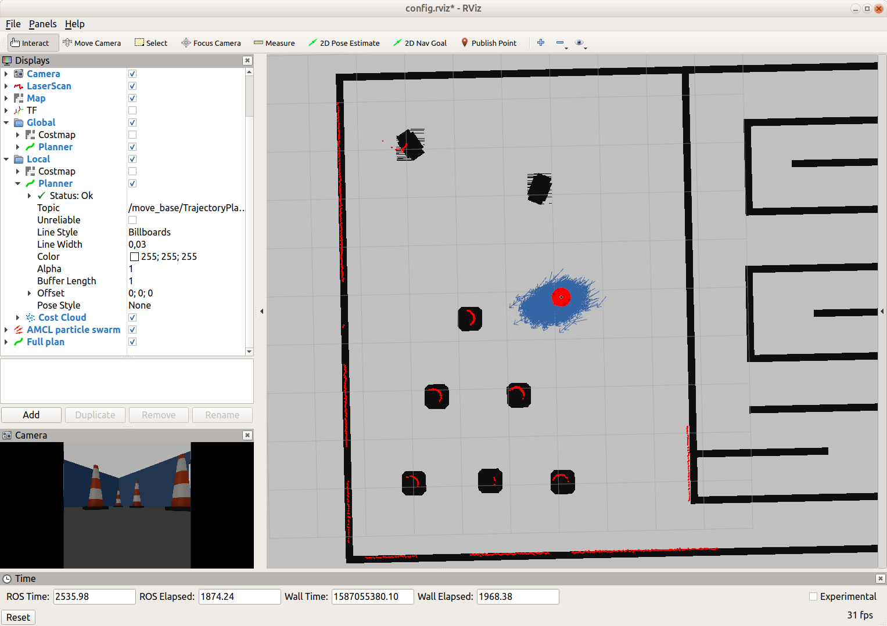
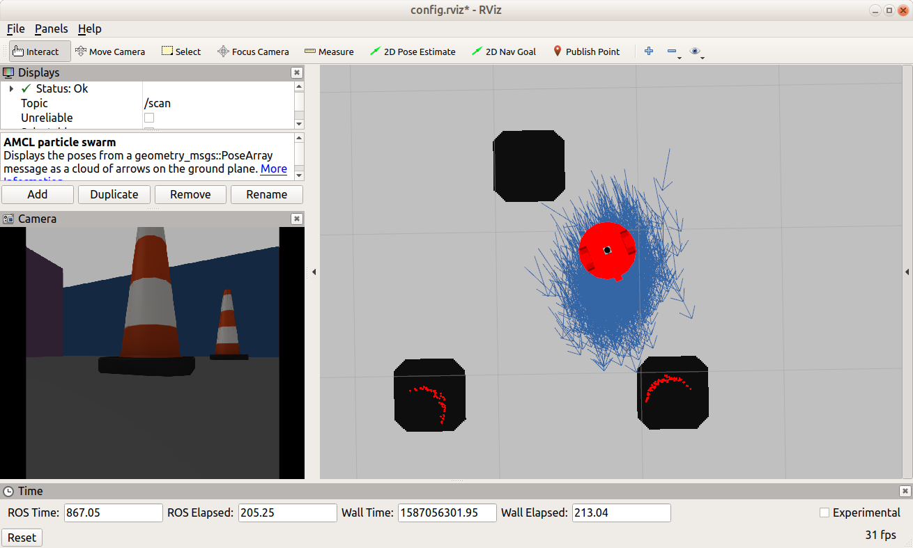
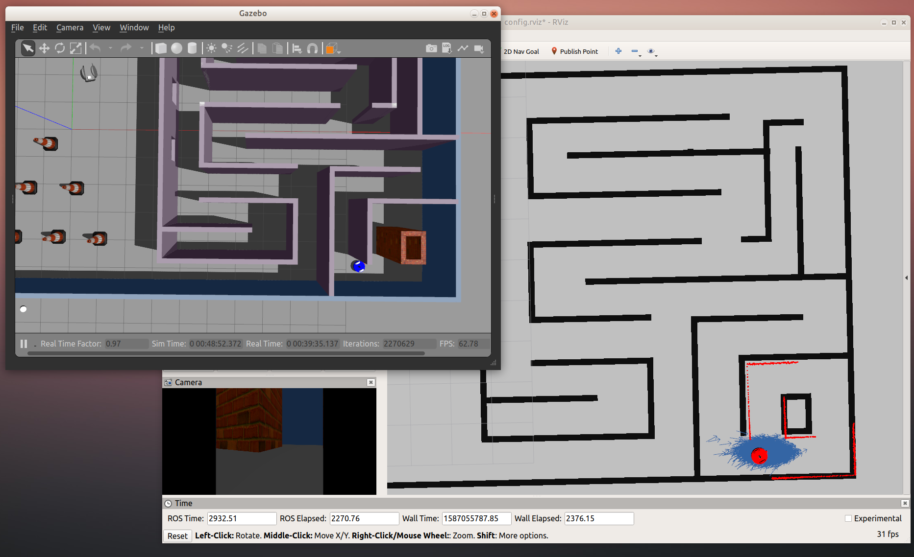

# Where am I?
**Experiments with localization of a ROS robot simulated in Gazebo, using the AMCL ROS package (Adaptive Monte-Carlo Localization)**
 
## Dependencies
The following needs to be installed:
- ROS Melodic or Kinetic and the corresponding Gazebo version;
- cmake 2.8.3 or later and gcc 7.5 or later.

Tested under Ubuntu 18.04 (Melodic) and Ubuntu 16.04 (Kinetic).
 
 ## Installation
Clone the GitHub repository:
```shell script
git clone https://github.com/fantauzzi/where_am_I.git
```
In the root of the clone repository run:
```shell script
catkin_make
source devel/setup.bash
```
It will build the application.

## Running it

In the root of the cloned repository run:
```shell script
source devel/setup.bash
roslaunch my_robot world.launch 
```
Gazebo and RViz will start, showing the environment and placing a blue robot in it.
  
In another shell, in the same directory, run:
```shell script
source devel/setup.bash
roslaunch my_robot amcl.launch 
```

To drive the robot around, run, again in the same directory:
```shell script
source devel/setup.bash
rosrun teleop_twist_keyboard teleop_twist_keyboard.py
```

The keyboard teleop node will start. The robot is non-holonomic (it has a differential drive). For the keyboard teleoperation to work, make sure you have its window/shell selected before typing.

RViz should start with some useful displays already configured. Its configuration file can also be manually loaded from `/where_am_I/src/my_robot/config/config.rviz`.

## Screenshots








## Credits
The keyboard teleop [package documentation](http://wiki.ros.org/teleop_twist_keyboard).

The map has been generated from the Gazebo world using [pgm_map_creator](https://github.com/udacity/pgm_map_creator). The package itself is not included in this repository as it is not available for (and doesn't build under) Melodic.

Templates for configuration files made available by Udacity as part of their Robotics Software Engineer Nanodegree Program; can also be found in ROS tutorials.