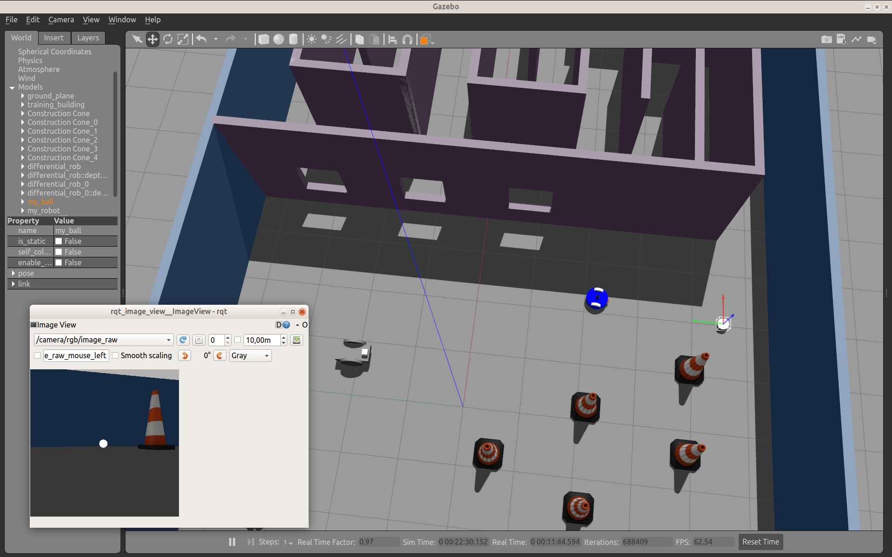

# Go Chase It!
**Experiments with building a simple ROS robot with URDF and XACRO and programming it to follow a white ball within
 a Gazebo simulation.**
 
## Dependencies
The following needs to be installed:
- ROS Melodic
- gazebo 9
- cmake 2.8.3 or later and gcc 7.5 or later

Tested under Ubuntu 18.04.
 
 ## Installation
Clone the GitHub repository:
```shell script
git clone https://github.com/fantauzzi/go_chase_it.git
```
In the root of the clone repository run:
```shell script
catkin_make
source devel/setup.bash
```
It will build the application.

## Running it

In the root of the cloned repository run:
```shell script
source devel/setup.bash
roslaunch my_robot world.launch
```
Gazebo and RViz will start, showing the environment, placing a blue robot in the environment and a white ball just
outside of it.
  
In another shell, in the same directory, run:
```shell script
source devel/setup.bash
roslaunch ball_chaser ball_chaser.launch
```

The necessary ROS nodes will start.

In Gazebo, select the `Translation Mode (T)`, then select the white ball and move it such that it enters the visual
field of the robot. You can check the robot visual field in RViz. The robot will move toward the ball, and, upon
reaching it, stop right in front of it. 




## Credits
The Gazebo plugins made available by Udacity as part of their Robotics Software Engineer Nanodegree Program can be
 [downloaded from here](https://s3-us-west-1.amazonaws.com/udacity-robotics/my_robot.gazebo). They provide simulation
  of the camera and lidar sensors, and the wheel motors.
